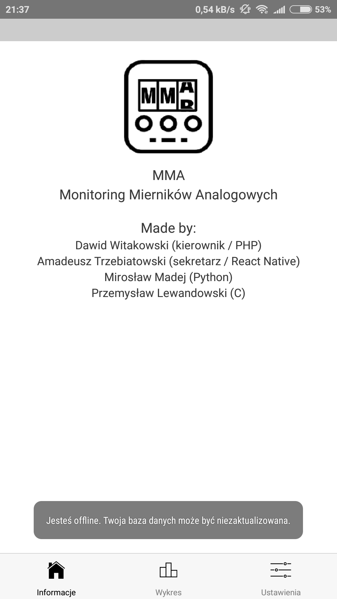
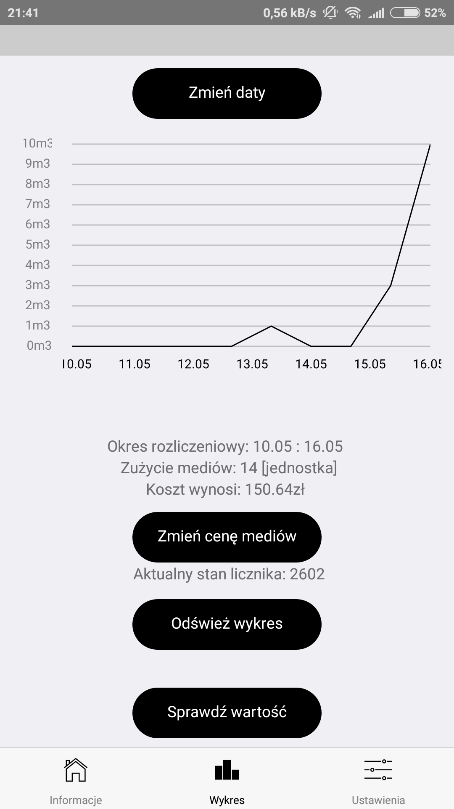
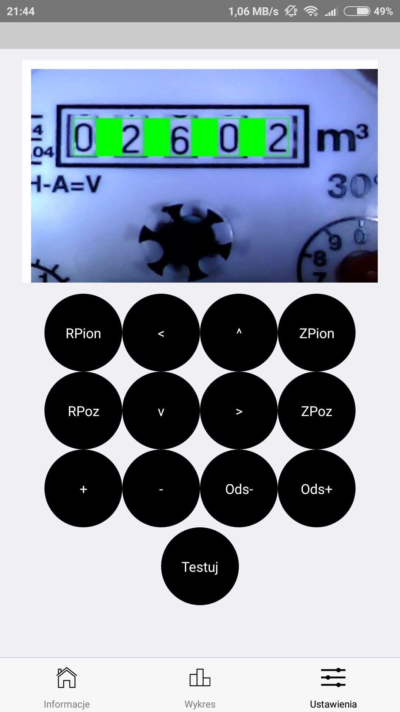
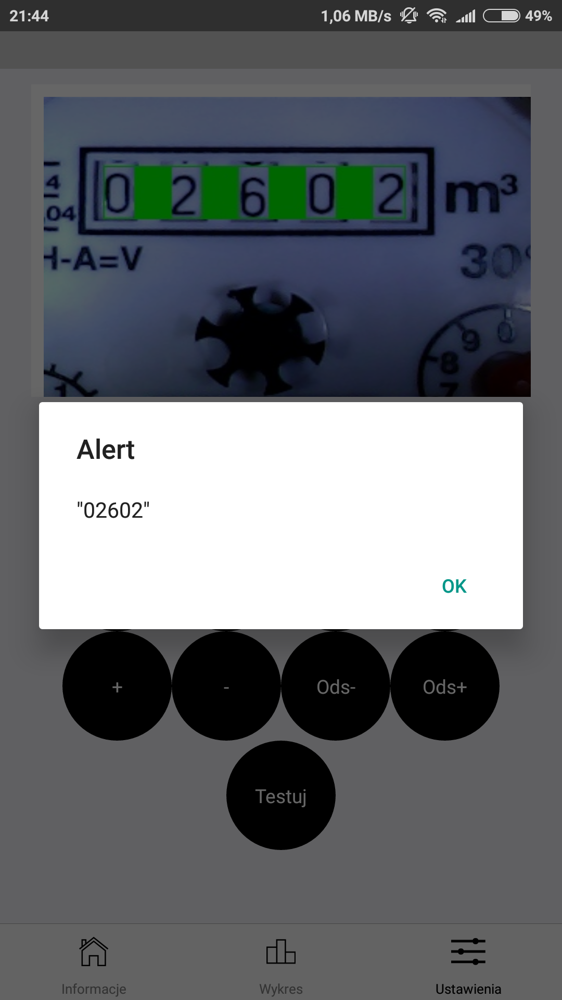

# PhoneApp
Aplikacja mobilna projektu "Monitoring Mierników Analogowych"

# Możliwości:
Komunikacja z Raspberry Pi, tworzenie wykresów na podstawie danych pobranych w formacie JSON, kalibracja kamery online

